[**Pytorch Activation Function Implementations**](./pytorch-activation-implementation.ipynb)

In this notebook, almost **all activation module/functions in pytorch** (in `torch.nn.modules.activation` / `torch.nn.functional`) 1.9 as C/C++ source is implemented as python, except some special activation modules. (`MultiheadAttention` for transformers, Softmax-like activations, ReLU-like non-popular activations)

Some back-propagations of activation are implemented as `torch.autograd.Function`. (use this as `Function.apply(tensor)`)

LaTeX formula will not appear properly in this page. See [`pytorch-activation-implementation.ipynb`](./pytorch-activation-implementation.ipynb) .

[](https://colab.research.google.com/github/kdha0727/pytorch-activation-implementation/blob/master/pytorch-activation-implementation.ipynb)

Implemented
<ul>
    <li id="Contents-Sigmoid"><a href="#Sigmoid">Sigmoid</a></li>
    <li id="Contents-Hardsigmoid"><a href="#Hardsigmoid">Hardsigmoid</a></li>
    <li id="Contents-Tanh"><a href="#Tanh">Tanh</a></li>
    <li id="Contents-Hardtanh"><a href="#Hardtanh">Hardtanh</a></li>
    <li id="Contents-Softsign"><a href="#Softsign">Softsign</a></li>
    <li id="Contents-ReLU"><a href="#ReLU">ReLU</a></li>
    <li id="Contents-ReLU6"><a href="#ReLU6">ReLU6</a></li>
    <li id="Contents-LeakyReLU"><a href="#LeakyReLU">LeakyReLU</a></li>
    <li id="Contents-PReLU"><a href="#PReLU">PReLU</a></li>
    <li id="Contents-Threshold"><a href="#Threshold">Threshold</a></li>
    <li id="Contents-ELU"><a href="#ELU">ELU</a></li>
    <li id="Contents-CELU"><a href="#CELU">CELU</a></li>
    <li id="Contents-Softplus"><a href="#Softplus">Softplus</a></li>
    <li id="Contents-LogSigmoid"><a href="#LogSigmoid">LogSigmoid</a></li>
    <li id="Contents-Swish"><a href="#Swish">Swish</a></li>
    <li id="Contents-Hardswish"><a href="#Hardswish">Hardswish</a></li>
    <li id="Contents-Mish"><a href="#Mish">Mish</a></li>
    <li id="Contents-GELU"><a href="#GELU">GELU</a></li>
    <li id="Contents-HardShrink"><a href="#HardShrink">HardShrink</a></li>
    <li id="Contents-SoftShrink"><a href="#SoftShrink">SoftShrink</a></li>
    <li id="Contents-TanhShrink"><a href="#TanhShrink">TanhShrink</a></li>
</ul>

Not Implemented
- RReLU [(Random Rectified Linear Unit)](https://pytorch.org/docs/stable/generated/torch.nn.RReLU.html) / SELU [(Scaled ELU)](https://pytorch.org/docs/stable/generated/torch.nn.SELU.html) / GLU [(Gated Linear Unit)](https://pytorch.org/docs/stable/generated/torch.nn.GLU.html)
- Softmax / Softmin / LogSoftmax / Softmax2d / AdaptiveLogSoftmaxWithLoss
- MultiheadAttention


# [Sigmoid](#Contents-Sigmoid)

$$ \text{Sigmoid}(x) = \sigma(x) = \frac{1}{1 + \exp(-x)} $$

```python
class Sigmoid(nn.Module):

    def forward(self, x):
        return 1. / (1. + torch.exp(-x))

```

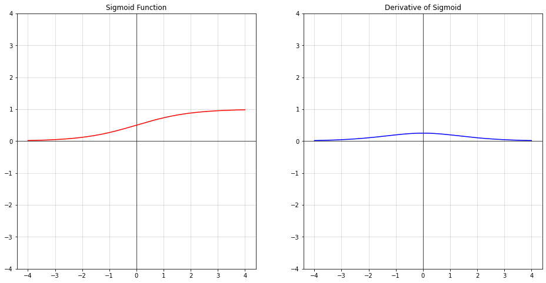

# [Hardsigmoid](#Contents-Hardsigmoid)

$$
\text{Hardsigmoid}(x) = \begin{cases}
    0 & \text{if~} x \le -3, \\
    1 & \text{if~} x \ge +3, \\
    x / 6 + 1 / 2 & \text{otherwise}
\end{cases}
$$

```python
class Hardsigmoid(nn.Module):

    def forward(self, x):
        return torch.clamp(x / 6. + 0.5, 0., 1.)

```

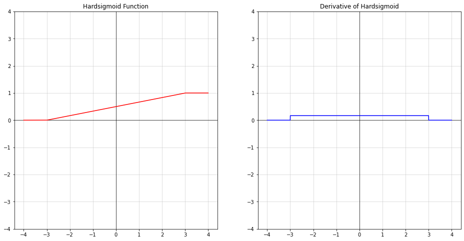

# [Tanh](#Contents-Tanh)

$$\text{Tanh}(x) = \tanh(x) = \frac{\exp(x) - \exp(-x)} {\exp(x) + \exp(-x)}$$

```python
class Tanh(nn.Module):

    def forward(self, x):
        # return torch.sigmoid(2. * x) * 2. - 1.
        pos = torch.exp(x)
        neg = torch.exp(-x)
        return (pos - neg) / (pos + neg)

```

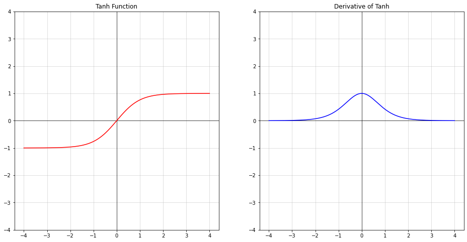

# [Hardtanh](#Contents-Hardtanh)

$$
\text{HardTanh}(x) = \begin{cases}
    1 & \text{ if } x > 1 \\
    -1 & \text{ if } x < -1 \\
    x & \text{ otherwise } \\
\end{cases}
$$

```python
class Hardtanh(nn.Module):

    def forward(self, x):
        return torch.clamp(x, -1., 1.)

```

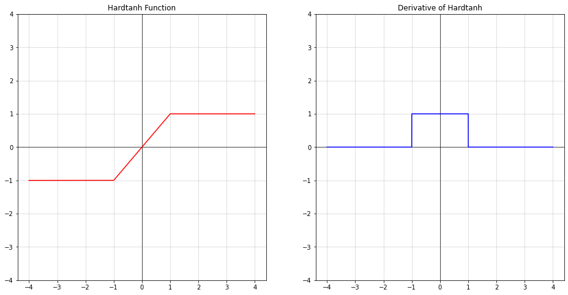

# [Softsign](#Contents-Softsign)

$$\text{SoftSign}(x) = \frac{x}{ 1 + |x|}$$

```python
class Softsign(nn.Module):

    def forward(self, x):
        return x / (1 + torch.abs(x))

```

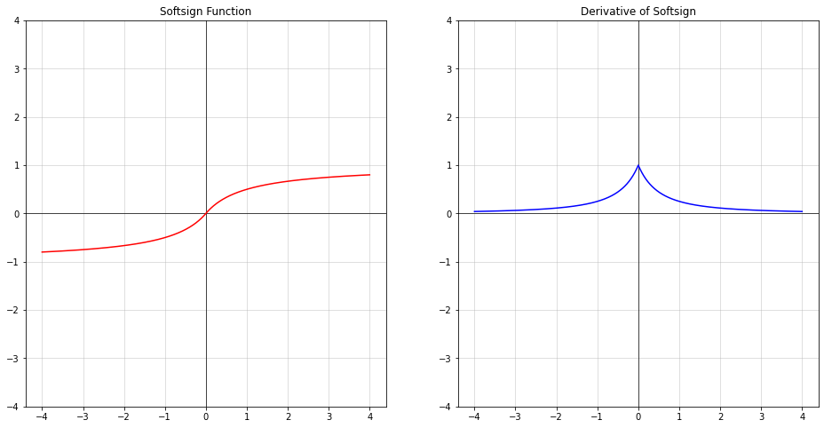

# [ReLU](#Contents-ReLU)

$$\text{ReLU}(x) = (x)^+ = \max(0, x)$$

```python
class ReLU(nn.Module):  # Rectified Linear Unit
    
    def forward(self, x):  # zeros_like: zero-filled tensor which has same shape with x
        return torch.maximum(x, torch.zeros_like(x))
    
```

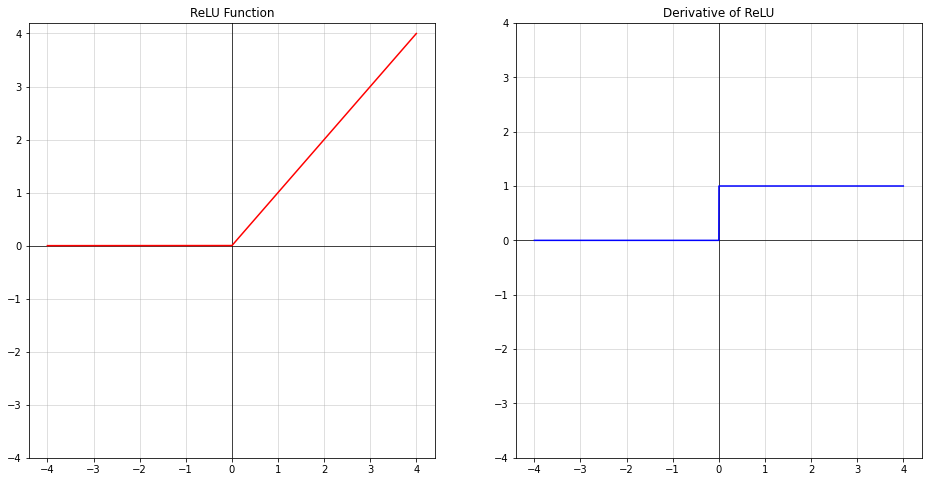

# [ReLU6](#Contents-ReLU6)

$$\text{ReLU6}(x) = \min(\max(0,x), 6)$$

```python
class ReLU6(nn.Module):  # Rectified Linear Unit
    
    def forward(self, x):
        return torch.clamp(x, 0., 6.)
    
```

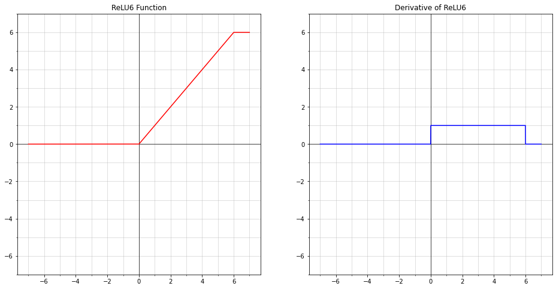

# [LeakyReLU](#Contents-LeakyReLU)

$$\text{LeakyReLU}(x) = \max(0, x) + \text{negative_slope} * \min(0, x)$$

```python
class LeakyReLU(nn.Moudule):  # Leaky - Rectified Linear Unit
    
    def __init__(self, negative_slope=1e-2):
        super().__init__()
        self.negative_slope = negative_slope
    
    def forward(self, x):
        return torch.where(x >= 0., x, x * self.negative_slope)

```

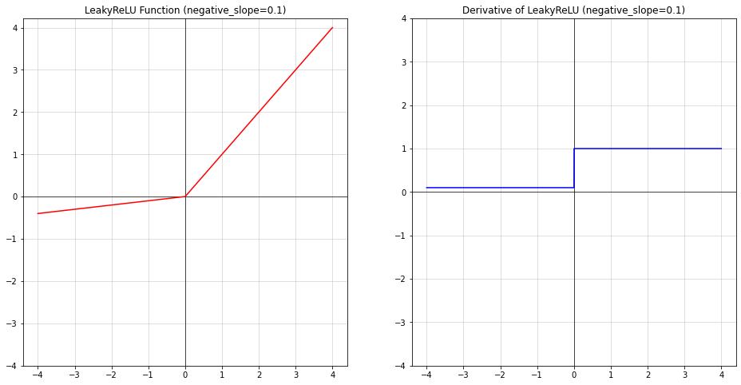

# [PReLU](#Contents-PReLU)

$$
\text{PReLU}(x) =
    \begin{cases}
    x, & \text{ if } x \geq 0 \\
    ax, & \text{ otherwise }
    \end{cases}
$$

$$\text{Here } a \text{ is a learnable parameter.}$$

```python
class PReLU(nn.Module):  # Parametric Rectified Linear Unit
    
    def __init__(self, a=.25):
        super().__init__()
        self.weight = nn.Parameter(torch.tensor(a))
    
    def forward(self, x):
        return torch.where(x >= 0., x, x * self.weight)
    
```

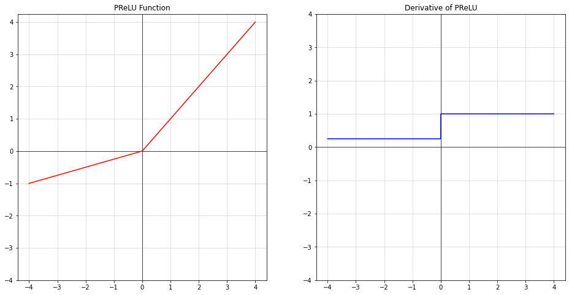

# [Threshold](#Contents-Threshold)

$$
y =
\begin{cases}
x, &\text{ if } x > \text{threshold} \\
\text{value}, &\text{ otherwise }
\end{cases}
$$

```python
class Threshold(nn.Module):
    
    def __init__(self, threshold=1., value=0.):
        super().__init__()
        self.threshold = threshold
        self.value = value
    
    def forward(self, x):
        return torch.where(x >= self.threshold, x, torch.zeros_like(x).fill_(self.value))
    
```

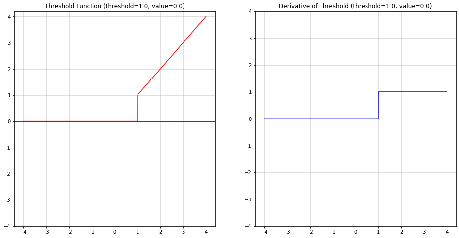

# [ELU](#Contents-ELU)

$$
\text{ELU}(x) = \begin{cases}
x, & \text{ if } x > 0\\
\alpha * (\exp(x) - 1), & \text{ if } x \leq 0
\end{cases}
$$

```python
class ELU(nn.Module):  # Exponential Linear Unit
    
    def __init__(self, alpha=1.):
        super().__init__()
        self.alpha = alpha
    
    def forward(self, x):
        return torch.where(x >= 0., x, (x.exp() - 1.) * self.alpha)
    
```

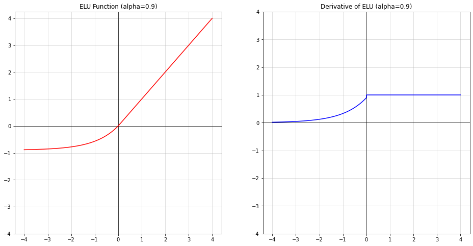

# [CELU](#Contents-CELU)

$$\text{CELU}(x) = \max(0,x) + \min(0, \alpha * (\exp(x/\alpha) - 1))$$

```python
class CELU(nn.Module):  # Continuously Differentiable ELU
    
    def __init__(self, alpha=1.):
        super().__init__()
        self.alpha = alpha
    
    def forward(self, x):
        return torch.where(x >= 0., x, (torch.exp(x / self.alpha) - 1.) * self.alpha)

```

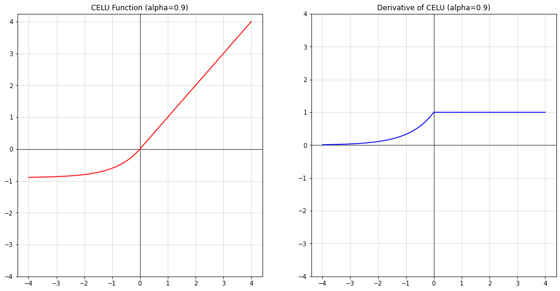

# [Softplus](#Contents-Softplus)

$$\text{Softplus}(x) = \frac{1}{\beta} * \log(1 + \exp(\beta * x))$$

```python
class Softplus(nn.Module):
    
    def __init__(self, beta=1.):
        super().__init__()
        self.beta = beta
    
    def forward(self, x):
        return torch.log(torch.exp(x * self.beta) + 1.)
    
```

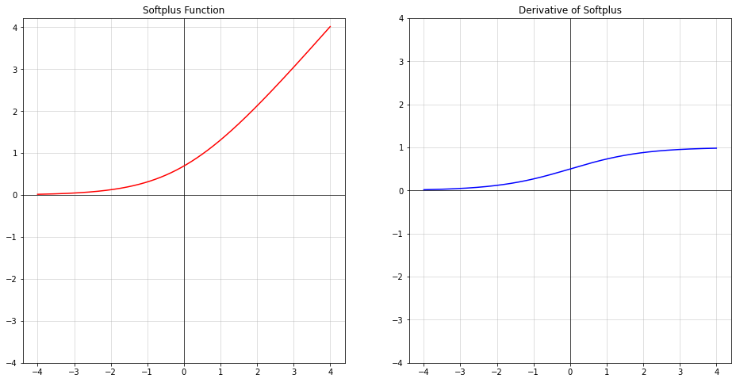

# [LogSigmoid](#Contents-LogSigmoid)

$$\text{LogSigmoid}(x) = \log\left(\frac{ 1 }{ 1 + \exp(-x)}\right)$$

```python
class LogSigmoid(nn.Module):
    
    def forward(self, x):
        return x.sigmoid().log()
    
```

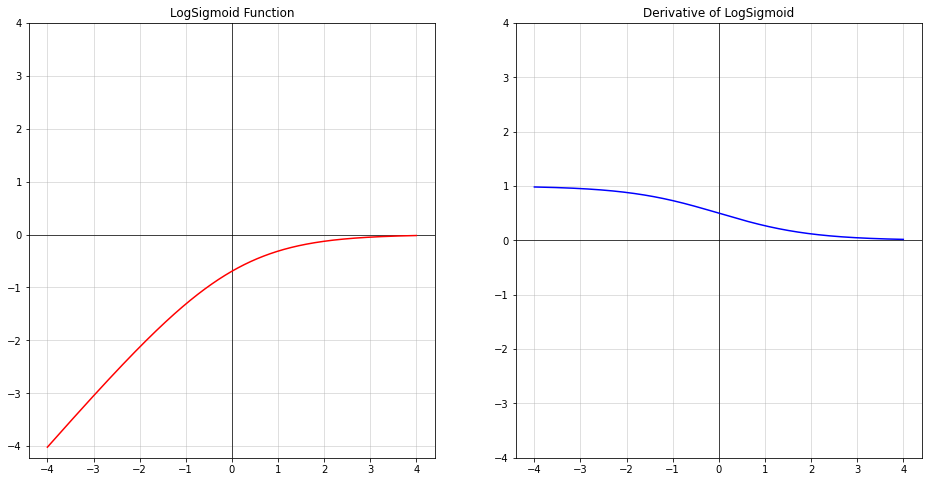

# [Swish](#Contents-Swish)

$$\text{Swish}(x) = \text{silu}(x) = x * \sigma(x), \text{where } \sigma(x) \text{ is the logistic sigmoid.}$$

```python
class Swish(nn.Module):  # same as nn.SiLU: Sigmoid Linear Unit
    
    def __init__(self, alpha=1.):
        super().__init__()
        self.alpha = alpha
    
    def forward(self, x):
        return x * torch.sigmoid(x * self.alpha)
    
```

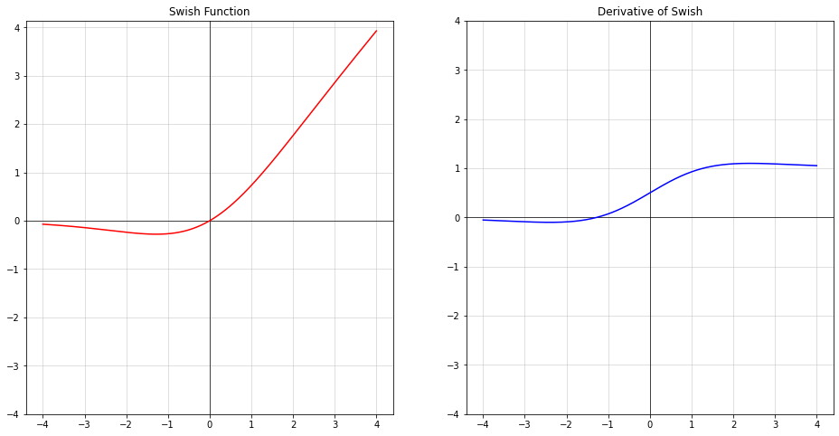

# [Hardswish](#Contents-Hardswish)

$$
\text{Hardswish}(x) = \begin{cases}
    0 & \text{if~} x \le -3, \\
    x & \text{if~} x \ge +3, \\
    x \cdot (x + 3) /6 & \text{otherwise}
\end{cases}
$$

```python
class Hardswish(nn.Module):  # mobilenetv3
    
    def forward(self, x):
        return torch.where(
            torch.logical_and(-3. < x, x < 3.),
            x * (x + 3.) / 6.,  # when: -3 < x < 3
            x.relu()
        )
    
```

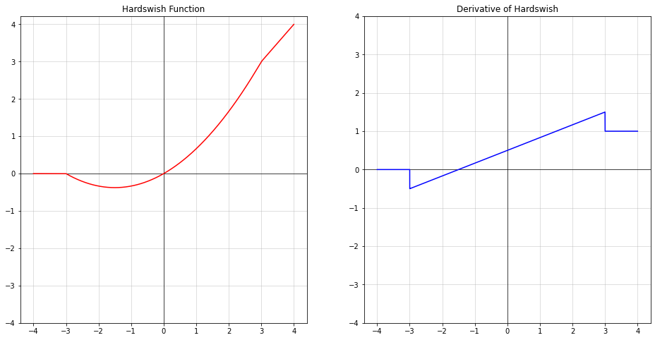

# [Mish](#Contents-Mish)

Mish is not implemented in pytorch.

$$\text{Mish}(x) = x * \text{Tanh}( \text{Softplus}(x) )$$

```python
class Mish(nn.Module):
    
    def forward(self, x):
        softplus_x = torch.log(torch.exp(x) + 1.)
        return x * torch.tanh(softplus_x)

```

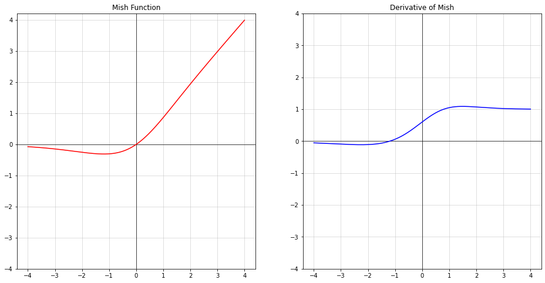

# [GELU](#Contents-GELU)

$$
\text{GELU}(x) = x * \Phi(x)
$$

$$
\text{where } \Phi(x) \text{ is the Cumulative Distribution Function for Gaussian Distribution.}
$$

```python
class GELU(nn.Module):  # Gaussian Error Linear Unit
    
    def forward(self, x):
        phi_x = (torch.erf(x / math.sqrt(2.)) + 1.) / 2.
        return x * phi_x

```

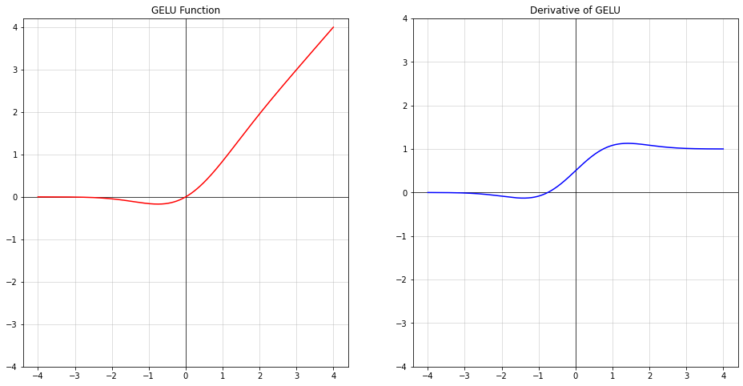

# [HardShrink](#Contents-HardShrink)

$$
\text{HardShrink}(x) =
\begin{cases}
x, & \text{ if } x > \lambda \\
x, & \text{ if } x < -\lambda \\
0, & \text{ otherwise }
\end{cases}
$$

```python

class HardShrink(nn.Module):
    
    def __init__(self, lambd=.5):
        super().__init__()
        self.lambd = lambd
    
    def forward(self, x):
        return torch.where(
            torch.logical_or(x > self.lambd, x < -self.lambd),
            x,
            torch.zeros_like(x)  # same as 0
        )

```

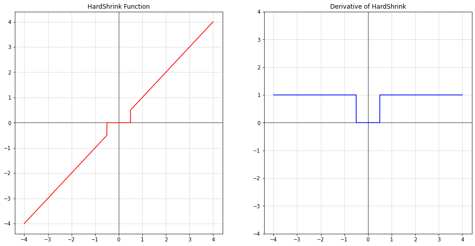

# [SoftShrink](#Contents-SoftShrink)

$$
\text{SoftShrinkage}(x) =
\begin{cases}
x - \lambda, & \text{ if } x > \lambda \\
x + \lambda, & \text{ if } x < -\lambda \\
0, & \text{ otherwise }
\end{cases}
$$

```python
class SoftShrink(nn.Module):
    
    def __init__(self, lambd=.5):
        super().__init__()
        self.lambd = lambd
    
    def forward(self, x):
        return torch.where(
            x > self.lambd, # 1st condition
            x - self.lambd,
            torch.where(
                x < -self.lambd,  # 2st condition
                x + self.lambd,
                torch.zeros_like(x)  # same as 0
            )
        )

```


# [TanhShrink](#Contents-TanhShrink)

$$
\text{Tanhshrink}(x) = x - \tanh(x)
$$

```python
class TanhShrink(nn.Module):
    
    def forward(self, x):
        return x - torch.tanh(x)

```

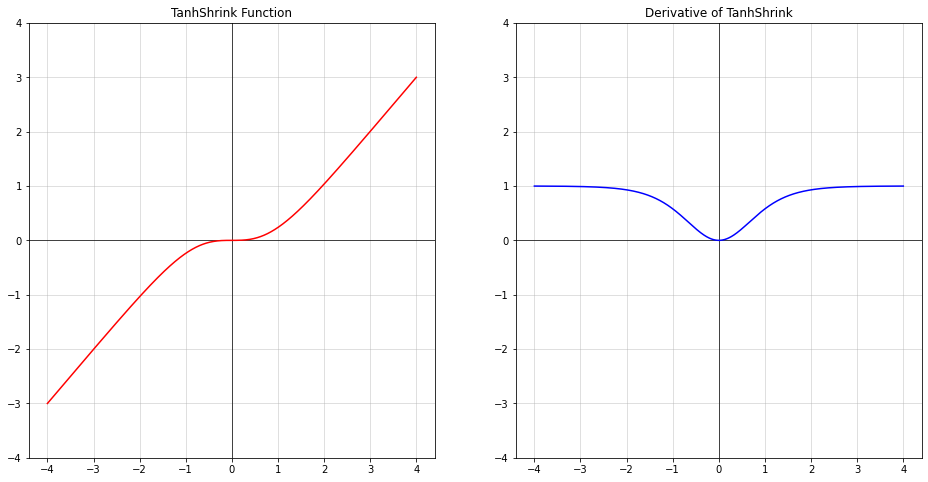
