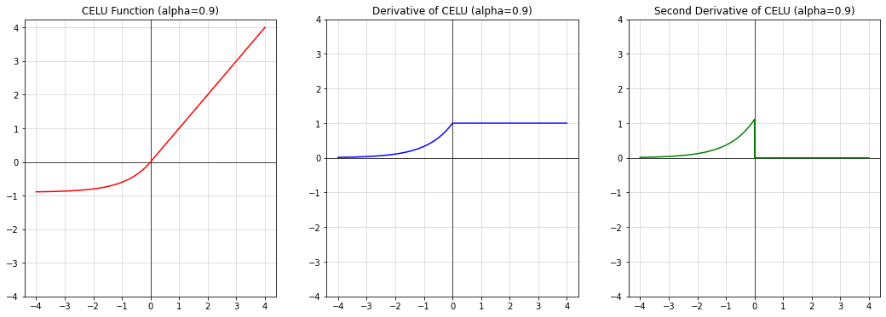

[**Pytorch Activation Function Implementations**](./pytorch-activation-implementation.ipynb)

```python
...
from .activation import Threshold, ReLU, Hardtanh, ReLU6, Sigmoid, Tanh, \
    Softmax, Softmax2d, LogSoftmax, ELU, SELU, CELU, GELU, Hardshrink, LeakyReLU, LogSigmoid, \
    Softplus, Softshrink, MultiheadAttention, PReLU, Softsign, Softmin, Tanhshrink, RReLU, GLU, \
    Hardsigmoid, Hardswish, SiLU, Mish
...
from .adaptive import AdaptiveLogSoftmaxWithLoss
...
```

Like given source code, there are 30 activation modules in pytorch.

In this notebook, almost **all activation module/functions in pytorch** (in `torch.nn.modules.activation` / `torch.nn.functional`) 1.9 as C/C++ source is implemented as python, except `MultiheadAttention` for transformers, and `AdaptiveLogSoftmaxWithLoss`.

Some back-propagations of activation are implemented as `torch.autograd.Function`.

LaTeX formula will not appear properly in this page. See [`pytorch-activation-implementation.ipynb`](./pytorch-activation-implementation.ipynb) .

[](https://colab.research.google.com/github/kdha0727/pytorch-activation-implementation/blob/master/pytorch-activation-implementation.ipynb)

Implemented
<ul>
<li id="Contents-Sigmoid"><a href="https://pytorch.org/docs/stable/generated/torch.nn.Sigmoid.html">Sigmoid</a></li>
<li id="Contents-Hardsigmoid"><a href="https://pytorch.org/docs/stable/generated/torch.nn.Hardsigmoid.html">Hardsigmoid</a></li>
<li id="Contents-Tanh"><a href="https://pytorch.org/docs/stable/generated/torch.nn.Tanh.html">Tanh</a></li>
<li id="Contents-Hardtanh"><a href="https://pytorch.org/docs/stable/generated/torch.nn.Hardtanh.html">Hardtanh</a></li>
<li id="Contents-Softsign"><a href="https://pytorch.org/docs/stable/generated/torch.nn.Softsign.html">Softsign</a></li>
<li id="Contents-ReLU"><a href="https://pytorch.org/docs/stable/generated/torch.nn.ReLU.html">ReLU</a></li>
<li id="Contents-ReLU6"><a href="https://pytorch.org/docs/stable/generated/torch.nn.ReLU6.html">ReLU6</a></li>
<li id="Contents-LeakyReLU"><a href="https://pytorch.org/docs/stable/generated/torch.nn.LeakyReLU.html">LeakyReLU</a></li>
<li id="Contents-PReLU"><a href="https://pytorch.org/docs/stable/generated/torch.nn.PReLU.html">PReLU</a></li>
<li id="Contents-Threshold"><a href="https://pytorch.org/docs/stable/generated/torch.nn.Threshold.html">Threshold</a></li>
<li id="Contents-ELU"><a href="https://pytorch.org/docs/stable/generated/torch.nn.ELU.html">ELU</a></li>
<li id="Contents-CELU"><a href="https://pytorch.org/docs/stable/generated/torch.nn.CELU.html">CELU</a></li>
<li id="Contents-Softplus"><a href="https://pytorch.org/docs/stable/generated/torch.nn.Softplus.html">Softplus</a></li>
<li id="Contents-LogSigmoid"><a href="https://pytorch.org/docs/stable/generated/torch.nn.LogSigmoid.html">LogSigmoid</a></li>
<li id="Contents-Swish"><a href="https://pytorch.org/docs/stable/generated/torch.nn.SiLU.html">Swish</a></li>
<li id="Contents-Hardswish"><a href="https://pytorch.org/docs/stable/generated/torch.nn.Hardswish.html">Hardswish</a></li>
<li id="Contents-Mish"><a href="https://pytorch.org/docs/stable/generated/torch.nn.Mish.html">Mish</a></li>
<li id="Contents-GELU"><a href="https://pytorch.org/docs/stable/generated/torch.nn.GELU.html">GELU</a></li>
<li id="Contents-HardShrink"><a href="https://pytorch.org/docs/stable/generated/torch.nn.Hardshrink.html">Hardshrink</a></li>
<li id="Contents-SoftShrink"><a href="https://pytorch.org/docs/stable/generated/torch.nn.Softshrink.html">Softshrink</a></li>
<li id="Contents-TanhShrink"><a href="https://pytorch.org/docs/stable/generated/torch.nn.Tanhshrink.html">Tanhshrink</a></li>
<li id="Contents-RReLU"><a href="https://pytorch.org/docs/stable/generated/torch.nn.RReLU.html">RReLU</a></li>
<li id="Contents-SELU"><a href="https://pytorch.org/docs/stable/generated/torch.nn.SELU.html">SELU</a></li>
<li id="Contents-GLU"><a href="https://pytorch.org/docs/stable/generated/torch.nn.GLU.html">GLU</a></li>
<li id="Contents-Softmax"><a href="https://pytorch.org/docs/stable/generated/torch.nn.Softmax.html">Softmax</a> (<a href="https://pytorch.org/docs/stable/generated/torch.nn.Softmax2d.html">Softmax2d</a>) </li>
<li id="Contents-Softmin"><a href="https://pytorch.org/docs/stable/generated/torch.nn.Softmin.html">Softmin</a></li>
<li id="Contents-LogSoftmax"><a href="https://pytorch.org/docs/stable/generated/torch.nn.LogSoftmax.html">LogSoftmax</a></li>
</ul>

Not Implemented
- <a href="https://pytorch.org/docs/stable/generated/torch.nn.AdaptiveLogSoftmaxWithLoss.html">AdaptiveLogSoftmaxWithLoss</a>
  - from [<Efficient softmax approximation for GPUs\>](https://arxiv.org/abs/1609.04309) by Edouard Grave, Armand Joulin, Moustapha Cissé, David Grangier, and Hervé Jégou
  - see [`torch.nn.modules.adaptive`](https://github.com/pytorch/pytorch/blob/master/torch/nn/modules/adaptive.py) (pure python implementation)
- <a href="https://pytorch.org/docs/stable/generated/torch.nn.MultiheadAttention.html">MultiheadAttention</a>
  - used for Transformer
  - from [<Attention Is All You Need\>](https://arxiv.org/abs/1706.03762)


# Sigmoid

$$\text{Sigmoid}(x) = \sigma(x) = \frac{1}{1 + \exp(-x)}$$


```python
@plot_activation_module()
class Sigmoid(ActivationModule):

    def forward(self, x):
        return 1. / (1. + torch.exp(-x))

```


    

    


# Hardsigmoid

$$
\text{Hardsigmoid}(x) = \begin{cases}
    0 & \text{if~} x \le -3, \\
    1 & \text{if~} x \ge +3, \\
    x / 6 + 1 / 2 & \text{otherwise}
\end{cases}
$$


```python
@plot_activation_module()
class Hardsigmoid(ActivationModule):

    @staticmethod
    def forward(x):
        x = x.pow(1.)  # TODO: remove this line (hack for second derivative)
        return (x / 6. + .5).clamp(0., 1.)

```


    


# Tanh

$$\text{Tanh}(x) = \tanh(x) = \frac{\exp(x) - \exp(-x)} {\exp(x) + \exp(-x)}$$


```python
@plot_activation_module()  # basic activation for RNN / LSTM
class Tanh(ActivationModule):

    def forward(self, x):
        # return torch.sigmoid(2. * x) * 2. - 1.
        pos = torch.exp(x)
        neg = torch.exp(-x)
        return (pos - neg) / (pos + neg)

```


    

    


# Hardtanh

$$
\text{HardTanh}(x) = \begin{cases}
    1 & \text{ if } x > 1 \\
    -1 & \text{ if } x < -1 \\
    x & \text{ otherwise } \\
\end{cases}
$$


```python
@plot_activation_module()
class Hardtanh(ActivationModule):

    def forward(self, x):
        x = x.pow(1.)  # TODO: remove this line (hack for second derivative)
        return x.clamp(-1., 1.)

```


    

    


# Softsign

$$\text{SoftSign}(x) = \frac{x}{ 1 + |x|}$$


```python
@plot_activation_module()
class Softsign(ActivationModule):

    def forward(self, x):
        return x / (1 + torch.abs(x))

```


    

    


# ReLU

$$\text{ReLU}(x) = (x)^+ = \max(0, x)$$


```python
@plot_activation_module()
class ReLU(ActivationModule):  # Rectified Linear Unit
    
    def forward(self, x):  # zeros_like: zero-filled tensor which has same shape with x
        x = x.pow(1.)  # TODO: remove this line (hack for second derivative)
        return x.clamp(0.)
    
```


    

    


# ReLU6

$$\text{ReLU6}(x) = \min(\max(0,x), 6)$$


```python
@plot_activation_module(True)
class ReLU6(ActivationModule):  # Rectified Linear Unit
    
    def forward(self, x):
        x = x.pow(1.)  # TODO: remove this line (hack for second derivative)
        return torch.clamp(x, 0., 6.)
    
```


    

    


# LeakyReLU

$$\text{LeakyReLU}(x) = \max(0, x) + \text{negative_slope} * \min(0, x)$$


```python
@plot_activation_module(negative_slope=1e-1)
class LeakyReLU(ActivationModule):  # Leaky - Rectified Linear Unit
    
    def __init__(self, negative_slope=1e-2):
        super().__init__()
        self.negative_slope = negative_slope
    
    def forward(self, x):
        x = x.pow(1.)  # TODO: remove this line (hack for second derivative)
        return torch.where(x >= 0., x, x * self.negative_slope)

```


    

    


# PReLU

$$
\text{PReLU}(x) =
    \begin{cases}
    x, & \text{ if } x \geq 0 \\
    ax, & \text{ otherwise }
    \end{cases}
$$

$$\text{Here } a \text{ is a learnable parameter.}$$


```python
@plot_activation_module()
class PReLU(ActivationModule):  # Parametric Rectified Linear Unit
    
    def __init__(self, a=.25):
        super().__init__()
        self.weight = nn.Parameter(torch.tensor(a))
    
    def forward(self, x):
        x = x.pow(1.)  # TODO: remove this line (hack for second derivative)
        return torch.where(x >= 0., x, x * self.weight)
    
```


    

    


# Threshold

$$
y =
\begin{cases}
x, &\text{ if } x > \text{threshold} \\
\text{value}, &\text{ otherwise }
\end{cases}
$$


```python
@plot_activation_module(threshold=1., value=0.)  # ThresholdReLU: value=0.
class Threshold(ActivationModule):
    
    def __init__(self, threshold=1., value=0.):
        super().__init__()
        self.threshold = threshold
        self.value = value
    
    def forward(self, x):
        x = x.pow(1.)  # TODO: remove this line (hack for second derivative)
        return x.masked_fill(x <= self.threshold, self.value)

```


    

    


# ELU

$$
\text{ELU}(x) = \begin{cases}
x, & \text{ if } x > 0\\
\alpha * (\exp(x) - 1), & \text{ if } x \leq 0
\end{cases}
$$


```python
@plot_activation_module(alpha=.9)
class ELU(ActivationModule):  # Exponential Linear Unit
    
    def __init__(self, alpha=1.):
        super().__init__()
        self.alpha = alpha
    
    def forward(self, x):
        return torch.where(x >= 0., x, (torch.exp(x) - 1.) * self.alpha)
    
```


    

    


# CELU

$$\text{CELU}(x) = \max(0,x) + \min(0, \alpha * (\exp(x/\alpha) - 1))$$


```python
@plot_activation_module(alpha=.9)
class CELU(ActivationModule):  # Continuously differentiable ELU
    
    def __init__(self, alpha=1.):
        super().__init__()
        self.alpha = alpha
    
    def forward(self, x):
        return torch.where(x >= 0., x, (torch.exp(x / self.alpha) - 1.) * self.alpha)

```


    

    


# Softplus

$$\text{Softplus}(x) = \frac{1}{\beta} * \log(1 + \exp(\beta * x))$$


```python
@plot_activation_module()  # Derivative becomes sigmoid
class Softplus(ActivationModule):
    
    def __init__(self, beta=1.):
        super().__init__()
        self.beta = beta
    
    def forward(self, x):
        return torch.log(torch.exp(x * self.beta) + 1.)
    
```


    

    


# LogSigmoid

$$\text{LogSigmoid}(x) = \log\left(\frac{ 1 }{ 1 + \exp(-x)}\right)$$


```python
@plot_activation_module()
class LogSigmoid(ActivationModule):
    
    def forward(self, x):
        return x.sigmoid().log()
    
```


    

    


# Swish

$$\text{Swish}(x) = \text{silu}(x) = x * \sigma(x), \text{where } \sigma(x) \text{ is the logistic sigmoid.}$$


```python
@plot_activation_module()  # activation for MobileNet / EfficientNet
class Swish(ActivationModule):  # same as nn.SiLU: Sigmoid Linear Unit
    
    def __init__(self, alpha=1.):
        super().__init__()
        self.alpha = alpha
    
    def forward(self, x):
        return x * torch.sigmoid(x * self.alpha)

```


    

    


# Hardswish

$$
\text{Hardswish}(x) = \begin{cases}
    0 & \text{if~} x \le -3, \\
    x & \text{if~} x \ge +3, \\
    x \cdot (x + 3) /6 & \text{otherwise}
\end{cases}
$$


```python
@plot_activation_module()
class Hardswish(ActivationModule):  # mobilenetv3
    
    def forward(self, x):
        return torch.where(
            torch.logical_and(-3. < x, x < 3.),
            x * (x + 3.) / 6.,  # when: -3 < x < 3
            x.relu()
        )
    
```


    

    


# Mish


$$\text{Mish}(x) = x * \text{Tanh}( \text{Softplus}(x) )$$


```python
@plot_activation_module()
class Mish(ActivationModule):
    
    def forward(self, x):
        softplus_x = torch.log(torch.exp(x) + 1.)
        return x * torch.tanh(softplus_x)

# see also: https://hongl.tistory.com/213
```


    

    


# GELU

$$
\text{GELU}(x) = x * \Phi(x)
$$

$$
\text{where } \Phi(x) \text{ is the Cumulative Distribution Function for Gaussian Distribution.}
$$

With Error Function, CDF can be reduced to:

$$ \Phi(x) = \frac{1}{2} \left[ \text{erf}\left( \frac{x}{\sqrt 2} \right) + 1 \right]$$


```python
@plot_activation_module()
class GELU(ActivationModule):  # Gaussian Error Linear Unit

    def gaussian_cdf_function(self, x):
        sqrt_two = math.sqrt(2.)
        phi_x = (torch.erf(x / sqrt_two) + 1.) / 2.
        return phi_x

    def forward(self, x):
        return x * self.gaussian_cdf_function(x)

# see also: https://hongl.tistory.com/236
```


    

    


# Hardshrink

$$
\text{HardShrink}(x) =
\begin{cases}
x, & \text{ if } x > \lambda \\
x, & \text{ if } x < -\lambda \\
0, & \text{ otherwise }
\end{cases}
$$


```python
@plot_activation_module()
class Hardshrink(ActivationModule):
    
    def __init__(self, lambd=.5):
        super().__init__()
        self.lambd = lambd
    
    def forward(self, x):
        x = x.pow(1.)
        return x.where(
            torch.logical_or(x > self.lambd, x < -self.lambd),
            torch.zeros_like(x)  # same as 0
        )

```


    

    


# Softshrink

$$
\text{SoftShrinkage}(x) =
\begin{cases}
x - \lambda, & \text{ if } x > \lambda \\
x + \lambda, & \text{ if } x < -\lambda \\
0, & \text{ otherwise }
\end{cases}
$$


```python
@plot_activation_module()
class Softshrink(ActivationModule):
    
    def __init__(self, lambd=.5):
        super().__init__()
        self.lambd = lambd
    
    def forward(self, x):
        x = x.pow(1.)
        return torch.where(
            x > self.lambd, # 1st condition
            x - self.lambd,
            torch.where(
                x < -self.lambd,  # 2st condition
                x + self.lambd,
                torch.zeros_like(x)  # same as 0
            )
        )

```


    

    


# Tanhshrink

$$
\text{Tanhshrink}(x) = x - \tanh(x)
$$


```python
@plot_activation_module()
class Tanhshrink(ActivationModule):
    
    def forward(self, x):
        return x - torch.tanh(x)

```


    

    


# RRelu

$$
        \text{RReLU}(x) =
        \begin{cases}
            x & \text{if } x \geq 0 \\
            ax & \text{ otherwise }
        \end{cases}
$$

where $a$ is randomly sampled from uniform distribution
$\mathcal{U}(\text{lower}, \text{upper})$.


```python
# explicitly add bounds to plot
@plot_activation_module(lower=1. / 8, upper=round(1. / 3, 3))
class RReLU(ActivationModule):  # Randomized ReLU
    
    def __init__(
        self,
        lower=1. / 8,
        upper=1. / 3
    ):
        super().__init__()
        self.lower = lower
        self.upper = upper

    def forward(self, input):
        input = input.pow(1.)  # hack for second derivative
        if self.training:
            return torch.where(
                input > 0., 
                input, 
                # rand_like: [0, 1) -> make it as distribution of [lower ,upper)
                input * (torch.rand_like(input) * (self.upper - self.lower) + self.lower)
            )
        else:
            return self.leaky_relu(input)

    def leaky_relu(self, input):
        negative_slope = (self.lower + self.upper) / 2
        return input.where(input < 0., input * negative_slope)

```


    

    


# SELU


$$\text{SELU}(x) = \text{scale} * (\max(0,x) + \min(0, \alpha * (\exp(x) - 1)))$$

$$alpha = 1.6732632423543772848170429916717$$
$$scale = 1.0507009873554804934193349852946$$


```python
@plot_activation_module()
class SELU(ActivationModule):  # Scaled ELU

    # Make it as final
    alpha = property(lambda self: 1.6732632423543772848170429916717)
    scale = property(lambda self: 1.0507009873554804934193349852946)
    
    def forward(self, x):
        return torch.where(x >= 0., x, (torch.exp(x) - 1.) * self.alpha) * self.scale

```


    

    


# GLU

$$\text{GLU}(a, b)= a \otimes \sigma(b)$$
$$\text{where }a\text{ is the first half of the input matrices and }b\text{ is the second half.}$$


```python
class GLU(ActivationModule):  # Gated Linear Unit
    
    def __init__(self, dim=-1):
        super().__init__()
        self.dim = dim

    def forward(self, input):
        a, b = input.chunk(2, dim=self.dim)
        return a * b.sigmoid()

```


# Softmax

$$\text{Softmax}(x_{i}) = \frac{\exp(x_i)}{\sum_j \exp(x_j)}$$


```python
class Softmax(ActivationModule):

    # Implicit Inference of Dim
    _get_softmax_dim = staticmethod(lambda ndim: 0 if ndim in (0, 1, 3) else 1)
    
    def __init__(self, dim=None):
        super().__init__()
        self.dim = dim

    def forward(self, input):
        dim = self.dim
        if dim is None:
            dim = self._get_softmax_dim(input.ndim)
        input = input - input.amin(dim).unsqueeze(dim)
        input_exp = input.exp()
        return input_exp / input_exp.sum(dim).unsqueeze(dim)

```


```python
class Softmax2d(Softmax, ActivationModule):  # TODO: remove multiple inheritance due to subclass searching

    def __init__(self):
        super().__init__(dim=1)

    def forward(self, input):
        assert input.ndim == 4, 'Softmax2d requires a 4D tensor as input'
        return super().forward(input)

```


# Softmin

$$\text{Softmin}(x_{i}) = \frac{\exp(-x_i)}{\sum_j \exp(-x_j)}$$


```python
class Softmin(Softmax, ActivationModule):

    def forward(self, input):
        return super().forward(-input)

```

# LogSoftmax

$$\text{LogSoftmax}(x_{i}) = \log\left(\frac{\exp(x_i) }{ \sum_j \exp(x_j)} \right)$$


```python
class LogSoftmax(Softmax, ActivationModule):

    def forward(self, input):
        return super().forward(input).log()

```
